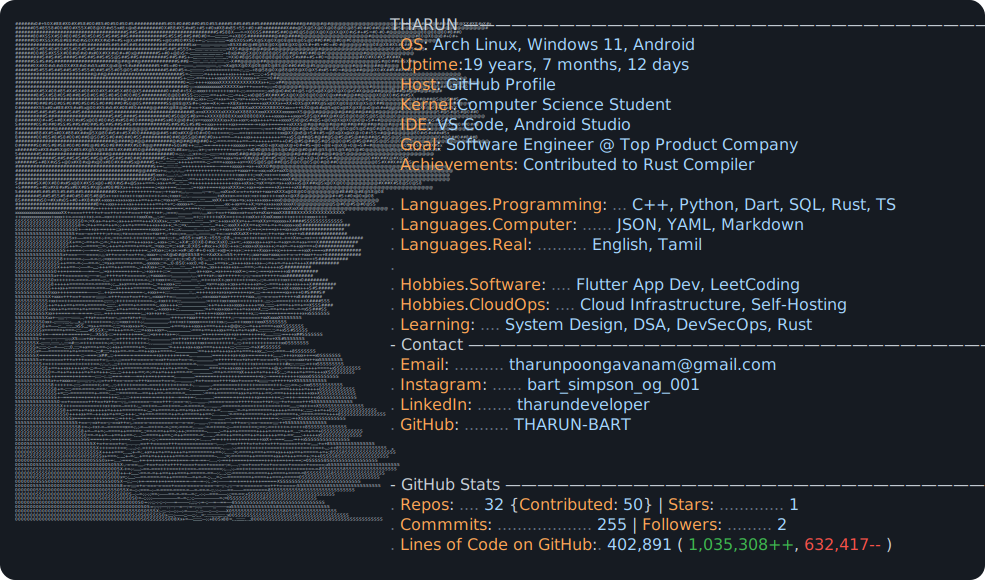

  

  

 

  

  🎓 <b>Computer Science & Business Engineering Student</b> 
  💻 <b>Aspiring Software Engineer @ Top Product-Based Company</b> 
  ☁️ <b>DevOps & Cloud Infrastructure Enthusiast</b>

---

### 🚀 About Me

- 🎯 Aiming to become a **Software Engineer** at a **Top Product-Based Company**
- 👀 Passionate about **Cloud Architecture**, **DevOps**, and **Containerization**
- 🐧 Proud **Arch Linux** user — love customizing window managers (Hyprland) and CLI environments
- 📱 Skilled in building scalable **mobile apps** using **Flutter**
- 🌱 Currently deep-diving into **Data Structures, Algorithms**, and **CI/CD Pipelines**
- 🤝 Always excited to collaborate on **open-source** and **real-world engineering projects**
- 🎧 Code + Tamil music = peak productivity 🚀

---

### 🔧 Skills & Technologies

<table>
  <tr>
    <td width="50%" valign="top">
      <h4>💻 Languages</h4>
      <code>Python</code> • <code>C</code> • <code>C++</code> • <code>Java</code> • <code>Dart</code> • <code>SQL</code> • <code>Rust</code> • <code>TypeScript</code>
    </td>
    <td width="50%" valign="top">
      <h4>☁️ Cloud & DevOps</h4>
      <code>Docker</code> • <code>Jenkins</code> • <code>CI/CD Pipelines</code> • <code>Linux (Arch)</code> • <code>Shell Scripting</code> • <code>Git</code>
    </td>
  </tr>
  <tr>
    <td width="50%" valign="top">
      <h4>🛠️ Frameworks & Tools</h4>
      <code>Flutter</code> • <code>Firebase</code> • <code>NestJS</code> • <code>REST APIs</code>
    </td>
    <td width="50%" valign="top">
      <h4>⚙️ Development Environments</h4>
      <code>VS Code</code> • <code>Android Studio</code> • <code>PyCharm</code> • <code>IntelliJ</code>
    </td>
  </tr>
</table>

---

### 🛠️ Tech Stack & Badges

  
  
  
  
  
  
  
  
  
  

---

### 📊 LeetCode & GitHub Stats

  

  
  

---

### 📫 Connect with Me

  
  
  

---

### ⚡ Fun Fact  
I learn fast, build fast, and love solving real engineering problems 🚀 — late-night coding is when I’m at my best 🌙
